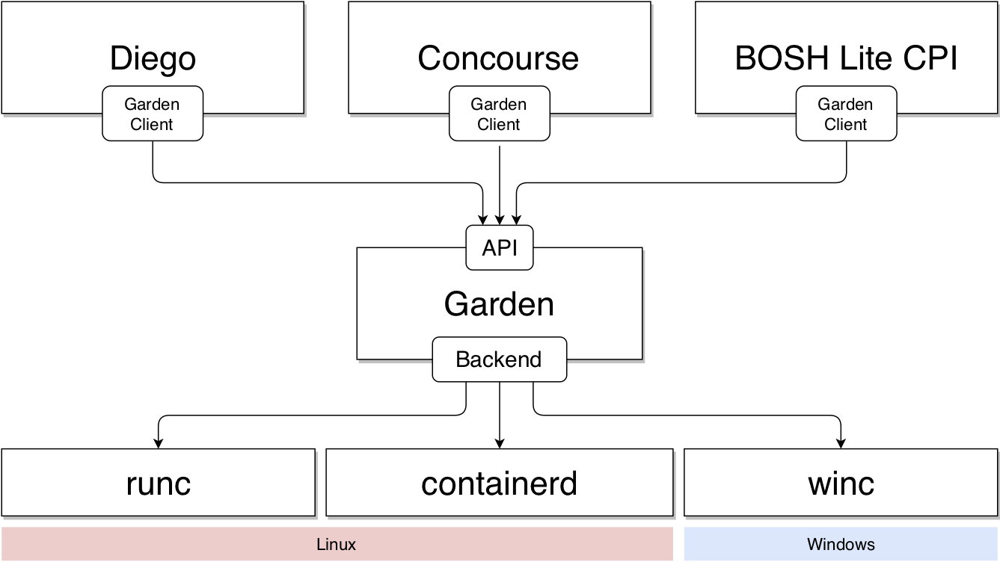

# Garden-RunC Operator’s Manual

### A Note on Naming: Garden, Garden-RunC and Guardian

Garden is a cross-platform API for managing containers with multiple implementations, referred to as "Back-ends". Back-ends include garden-windows and garden-runc. This document describes garden-runc. Garden-RunC (which is the overall product) primarily uses the "Guardian" component to implement the "Garden" API using "runC".

## Important Directories

### The Depot

Guardian stores container bundles in the standard OCI format underneath a directory called "the depot". 

If you deployed guardian using garden-runc-release the depot is located at `/var/vcap/data/garden/depot`. 

#### Container subdirectories

Each subdirectory of the depot describes a single container in a format known as an "OCI Bundle". This is essentially a directory containing an OCI-format `config.json` which is the configuration passed to `runc create` to create a container. 

#### Process subdirectories

For each process created inside the container (via the garden `container.Run` API) a subdirectory is created in `$depot_dir/$container_handle/processes/$process_guid`.

Inside this directory are named pipes (FIFOs) representing the stdin/out/err streams, a pipe named ‘exit’ which remains open while the process is open and then is closed when it exits and a named pipe named ‘winsz’ which is used to communicate window size change events to the running process. These files are connected to the container process by the `dadoo` helper executable (described below), allowing guardian to re-connect to the process’s streams and wait for the process to exit even after restarting.

### The Graph

The graph stores the filesystem layers which make up the root filesystem images for containers. In the case of docker images these are downloaded from a remote docker registry. In the case of "preloaded" root filesystems these are imported from a path on disk. 

To determine which path in the graph is being used as the root filesystem of a particular container, you can look for the “rootfs” property inside the `config.json` file in the container’s bundle directory.

If you installed garden-runc-release using bosh, the graph is located at `/var/vcap/data/garden/aufs_graph`. 

**Note:** For implementation reasons, if you deployed garden-runc-release using bosh, before interacting with containers it is currently neccesary to run `/var/vcap/packages/guardian/bin/inspector-garden -pid $(pidof guardian) /bin/bash`. This ensures the graph path is properly visible. You must be root to run this command.

## Guardian Components

Guardian consists of three primary “modules”, these are the Networker, The RootFS Manager and the Containerizer. In a default garden-runc installation, these are implemented by the built-in “kawasaki”, “garden-shed” and “rundmc” components, respectively.

It is possible to override the networker and the rootfs manager by specifying, respectively, the `network_plugin` and/or the `image_plugin` bosh properties. Setting either of these properties to the path of a binary will cause guardian to shell out to that binary to create the network and/or to download and prepare the root filesystem for the container._

The [container-to-container networking project](https://github.com/cloudfoundry-incubator/netman-release) implements the `network_plugin` contract and the “[grootFS](https://github.com/cloudfoundry/grootfs-release)” btrfs-based oci-compliant rootfs manager implements the `image_plugin` contract.

### RunDMC

RunDMC is Guardian’s containerizer. It is a super-small wrapper around runc with two jobs. Firstly it manages the ‘depot’ directory (see above), creating, listing and destroying container bundles as requested (in the code this is the `DirDepot` component). Secondly it executes `runc` commands to actually create, run and manage the container lifecycle (in the code this is the `RuncRunner` component).

### Garden-Shed

Garden-Shed is the built-in root filesystem management component which is used by default and if no `image_plugin` is configured. Garden-shed uses `aufs` to efficiently combine filesystem layers, along with dynamically created loop devices to implement disk quotas. 

### Kawasaki

Kawasaki is Guardian’s built-in networking component, used by default and if no `network_plugin` is configured. Kawasaki is invoked to configure the network of a created container before any user processes are run. 

### Dadoo

At runtime, you will see that guardian itself runs as a daemon process to which your client connects (normally over a unix socket). For each running container, guardian uses the `runc create` command against a particular bundle directory in the depot dir to create a container. This container immediately runs a no-op “init” process which simply sleeps (garden does not support overriding the init process in containers as this is a special system process). As processes are run inside the container (for example user apps), guardian spawns a process named `dadoo` which then calls `runc exec` to run the requested process (in other words, [dadoo runs runC](https://www.youtube.com/watch?v=dqgtsai2aKY)). Dadoo keeps running as long as the user’s process runs, monitoring its exit status and eventually writing it to a file in the `processes/$processid` subdir. If guardian is restarted it is able to reconnect to the running process via dadoo.

## Interacting with a Container

At runtime, bundles from the depot directory are run using [runC](http://github.com/opencontainers/runc). As these are standard runc containers and processes, you can interact with them for debug purposes using runc itself (or any compatible tool). For example, to execute a process in a container you can execute `runc exec $containerid /bin/sh` (where $containerid is the directory name of the depot subdirectory in question), to get events from a container you can run `runc events $containerid` and so on. More documentation on runC is available [on its github page](http://github.com/opencontainers/runc).

**Note:** For implementation reasons, if you deployed garden-runc-release using bosh, before interacting with containers it is currently neccesary to run `/var/vcap/packages/guardian/bin/inspector-garden -pid $(pidof guardian) /bin/bash`. This ensures the graph path is properly visible. You must be root to run this command.