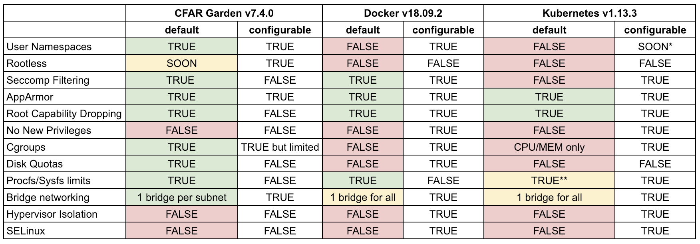

# Security Overview

The following table provides an overview of container security mechanisms across various container systems.
Table last updated 15/06/18.

* \* https://github.com/kubernetes/kubernetes/pull/64005
* \*\* Fewer masked paths than garden/docker (e.g. /proc/scsi)

* User Namespaces - True if processes are started in new, separate user namespaces
* Rootless - True if the process responsible for creating/managing containers is run as a non-root user
* Seccomp - Filtering	True if a hardened seccomp filter is applied to container processes
* AppArmor - True if a hardened AppArmor profile is applied to container processes
* Root Capability Dropping - True if container processes running as root have a drastically reduced set of capabilities
* No New Privileges - True if no_new_privs is set for container processes
* Cgroups - True if container processes' access to physical resources restricted by Cgroups
* Disk Quotas - True if container processes have a limit on disk usage
* Procfs/Sysfs limits - True if access to "dangerous" files in /proc and /sys is masked
* Bridge networking - Depends, see table for further info
* Hypervisor Isolation - True if containers are actually VMs
* SELinux - True if container processes are restricted by SELinux

* Table inspired by: https://blog.jessfraz.com/post/containers-security-and-echo-chambers

## Environments

* Cloud Foundry Application Runtime v1.40.0 - Standard deployment on Ubuntu trusty stemcell
* Docker v18.03.1-ce - Standard install on Ubuntu xenial
* Kubernetes v1.10.4 - Standard deployment on GCP via [kube-up.sh](https://github.com/kubernetes/kubernetes/blob/v1.10.4/cluster/kube-up.sh)
